# Secure System Development - Lab 1 Report

## Overview

This report documents the steps taken to set up a self-managed GitLab server and Runner. The tasks include deploying GitLab Server, setting up GitLab Runner, and integrating SAST using Semgrep.

---

## Task 1: Setting Up GitLab Server

### Step 1: Provisioning EC2 Instances

- Created two Amazon EC2 instances:
  - **GitLab Server**: Hosts the GitLab application.
  - **GitLab Runner**: Executes CI/CD jobs.
  
**Evidence**:

- GitLab Server Instance:
  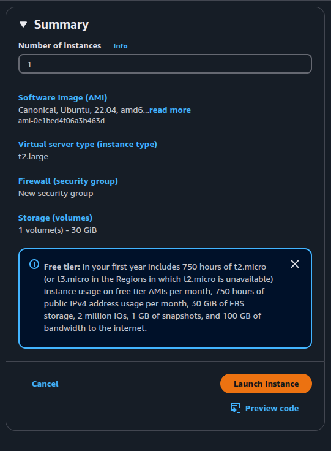
- GitLab Runner Instance:
  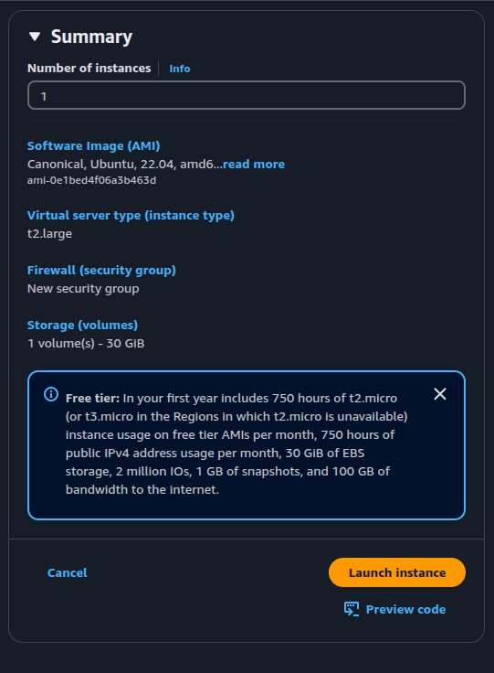

---

### Step 2: Configuring Security Groups

- Updated security groups to allow inbound traffic:
  - **GitLab Server**:
    - SSH on port 2222
    - HTTP on port 80
    - HTTPS on port 443
  - **GitLab Runner**:
    - SSH on port 22
    - HTTP on port 80
    - HTTPS on port 443

**Evidence**:

- GitLab Server Security Group:
  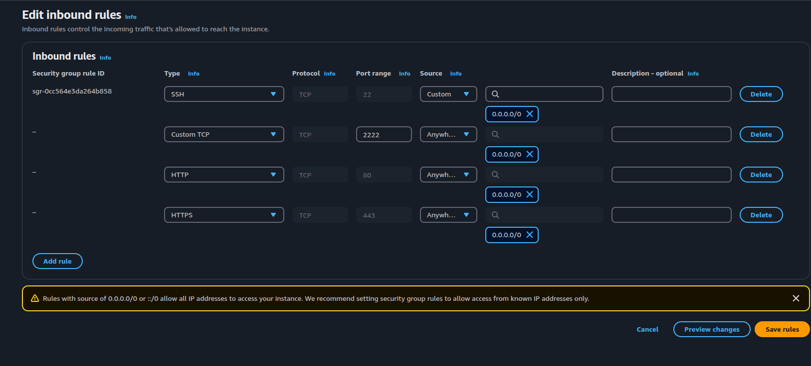
- GitLab Runner Security Group:
  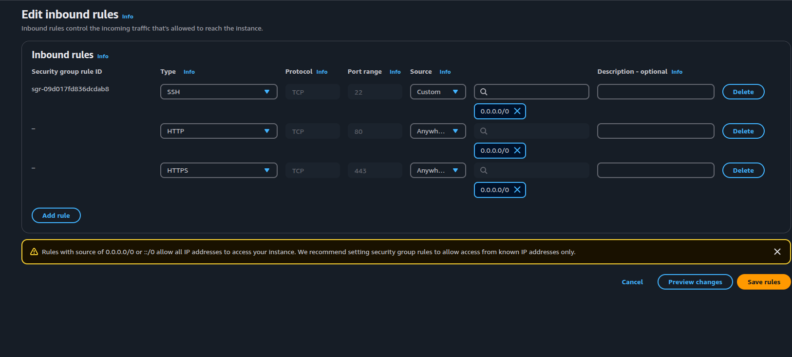

---

### Step 3: Installing Docker on GitLab Server

- Connected to the GitLab Server instance via SSH and installed Docker.

**Commands Executed**:

```bash
ssh -i "gitlab1.pem" ubuntu@ec2-54-157-39-84.compute-1.amazonaws.com

# Add Docker's official GPG key:
sudo apt-get update
sudo apt-get install ca-certificates curl
sudo install -m 0755 -d /etc/apt/keyrings
sudo curl -fsSL https://download.docker.com/linux/ubuntu/gpg -o /etc/apt/keyrings/docker.asc
sudo chmod a+r /etc/apt/keyrings/docker.asc

# Add the repository to Apt sources:
echo \
  "deb [arch=$(dpkg --print-architecture) signed-by=/etc/apt/keyrings/docker.asc] https://download.docker.com/linux/ubuntu \
  $(. /etc/os-release && echo "${UBUNTU_CODENAME:-$VERSION_CODENAME}") stable" | \
  sudo tee /etc/apt/sources.list.d/docker.list > /dev/null
sudo apt-get update

sudo apt-get install docker-ce docker-ce-cli containerd.io docker-buildx-plugin docker-compose-plugin

sudo usermod -aG docker $USER
newgrp docker
docker -v
docker compose version
```

**Evidence**:

- Docker Installation:
  

---

### Step 4: Creating `docker-compose.yml` for GitLab Server

- Created a `docker-compose.yml` file to configure and run the GitLab container.

**File Content**:

```yaml
version: '3.8'
services:
  gitlab:
    image: gitlab/gitlab-ce:latest
    container_name: 22BS283-gitlab
    restart: always
    hostname: 'gitlab.test.local'
    environment:
      GITLAB_OMNIBUS_CONFIG: |
        external_url 'https://gitlab.test.local'
        gitlab_rails['gitlab_shell_ssh_port'] = 2222
        nginx['http2_enabled'] = true
        nginx['redirect_http_to_https'] = true
        nginx['ssl_certificate'] = "/etc/gitlab/ssl/gitlab.test.local.crt"
        nginx['ssl_certificate_key'] = "/etc/gitlab/ssl/gitlab.test.local.key"
        gitlab_rails['registry_enabled'] = false
        mattermost['enable'] = false
        gitlab_pages['enable'] = false
        gitlab_kas['enable'] = false
        letsencrypt['enable'] = false
    ports:
      - '80:80'
      - '443:443'
      - '2222:22'
    volumes:
      - '/srv/gitlab/config:/etc/gitlab'
      - '/srv/gitlab/logs:/var/log/gitlab'
      - '/srv/gitlab/data:/var/opt/gitlab'
      - '/etc/gitlab/ssl:/etc/gitlab/ssl'
    shm_size: '256m'
```

**Evidence**:

- `docker-compose.yml` File:
  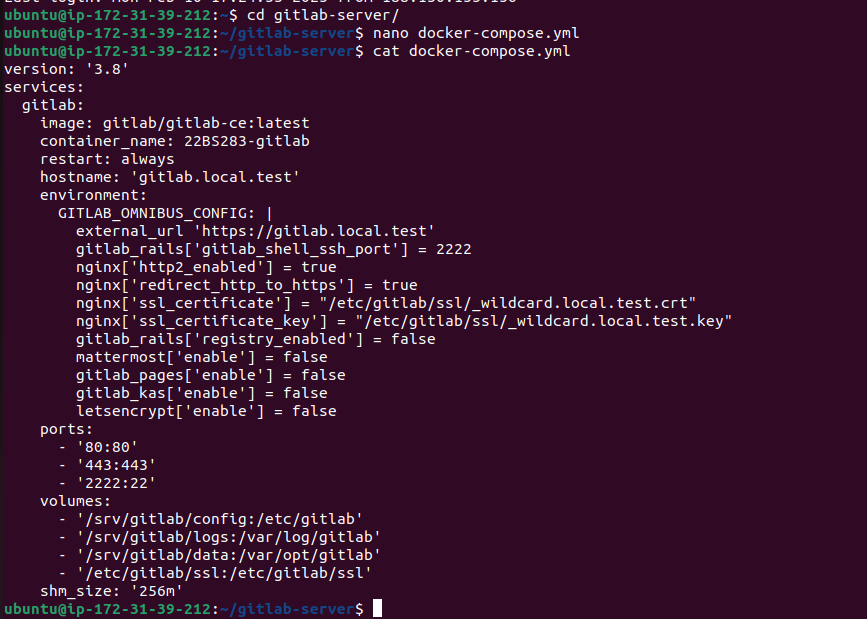

---

### Step 5: Generating Self-Signed Certificates with `mkcert`

- Installed `mkcert` and generated self-signed certificates for HTTPS.

**Evidence**:

- Certificate Generation:
  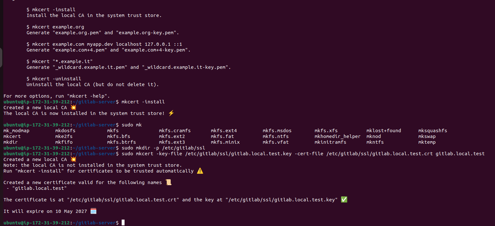

---

### Step 6: Updating `/etc/hosts`

- Updated the `/etc/hosts` file to resolve `gitlab.test.local` to the server's public IP.

**Evidence**:

- Updated `/etc/hosts`:
  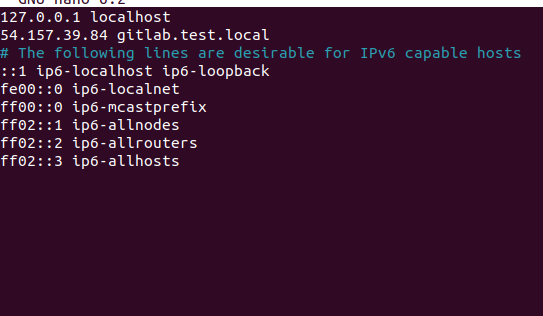

---

### Step 7: Running GitLab Server

- Started the GitLab container using `docker-compose`.

**Evidence**:

- GitLab Server Running:
  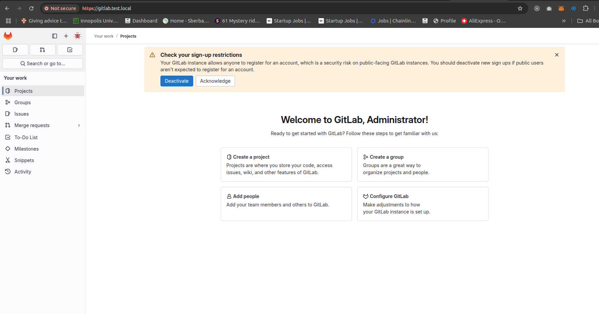

---

### Step 8: Creating a Repository

- Created an empty repository named `22BS283-repo`.

**Evidence**:

- Repository Creation:
  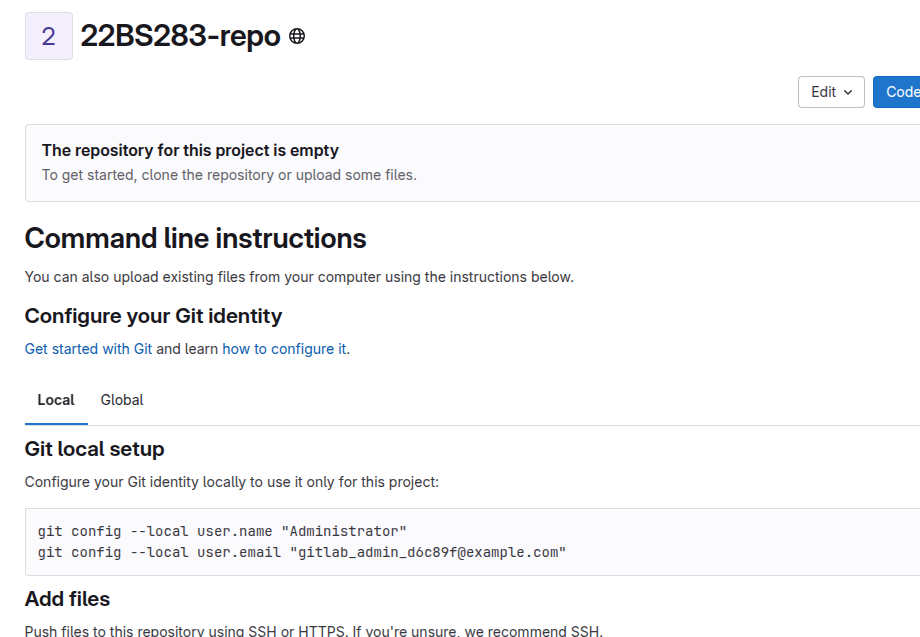

---

## Task 2: Setting Up GitLab Runner

### Step 1: Installing GitLab Runner

- Installed GitLab Runner on the second EC2 instance.

**Evidence**:

- GitLab Runner Installation:
  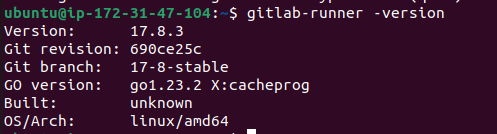

---

### Step 2: Updating `/etc/hosts` on Runner

- Updated the `/etc/hosts` file on the Runner to resolve `gitlab.test.local`.

**Evidence**:

- Updated `/etc/hosts` on Runner:
  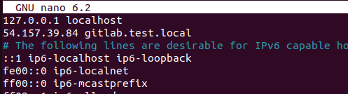

---

### Step 3: Adding GitLab Server Certificate to Runner

- Added the GitLab server's self-signed certificate to the Runner to establish trust.

**Evidence**:

- Certificate Addition:
  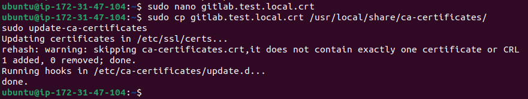

---

### Step 4: Creating and Registering Runner

- Created a GitLab Runner with the tag `22BS283-runner` and registered it with the GitLab server.

**Evidence**:

- Runner Creation:
  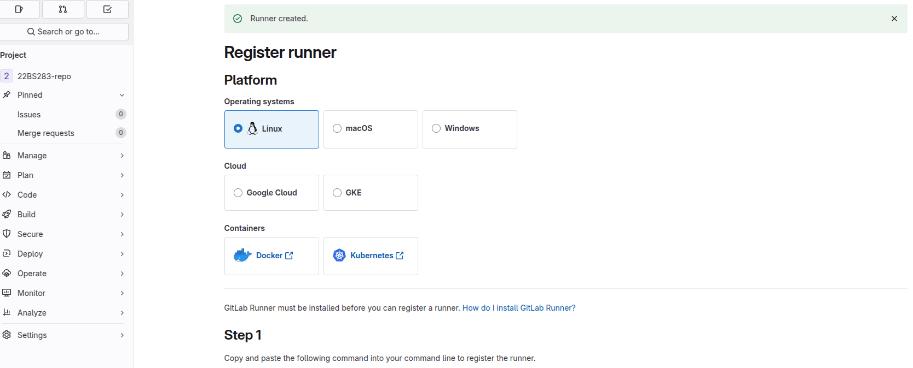
- Runner Registration:
  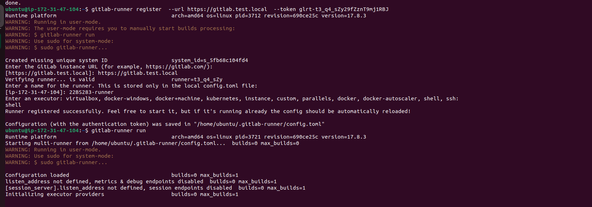

---

### Step 5: Validating Runner Connection

- Verified that the Runner is connected to the GitLab server.

**Evidence**:

- Runner Validation:
  

---

## Task 3: Integrating SAST with GitLab CI

### Step 1: Cloning a Vulnerable Application

- Cloned the Damn Vulnerable Java Application (DVJA) and removed its `.git` directory.

**Evidence**:

- Cloning DVJA:
  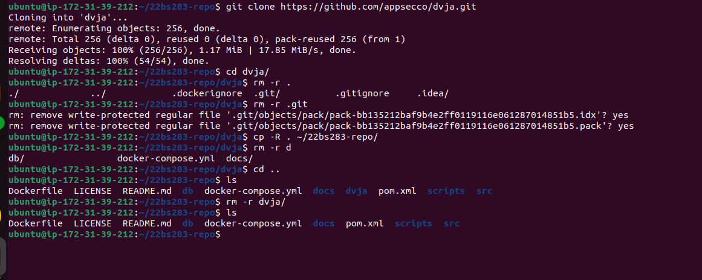

---

### Step 2: Creating `.gitlab-ci.yml`

- Added a `.gitlab-ci.yml` file to run Semgrep scans on the codebase.

**File Content**:

```yaml
stages:
  - test

semgrep-sast:
  stage: test
  script:
    - semgrep --config=auto --json > semgrep-report.json
  artifacts:
    paths:
      - semgrep-report.json
  rules:
    - if: $CI_COMMIT_REF_NAME == "main"
```

---

### Step 3: Pushing Code and Testing CI

- Pushed the code to the repository and verified that the CI pipeline runs on every push to the `main` branch.

**Evidence**:

- CI Pipeline Execution:
  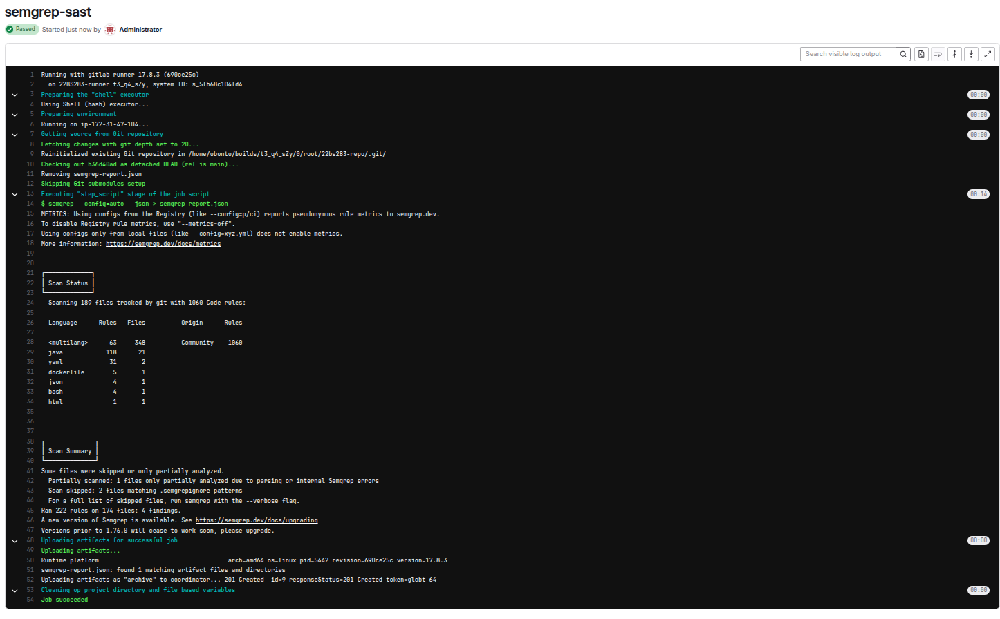
- CI Pipeline:
  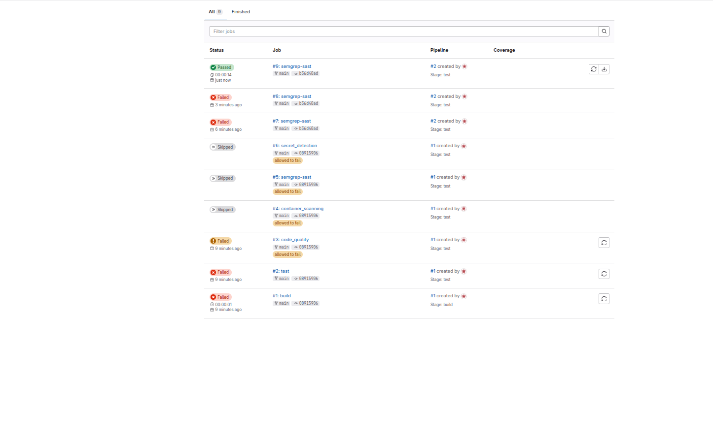
- Artifacts:
  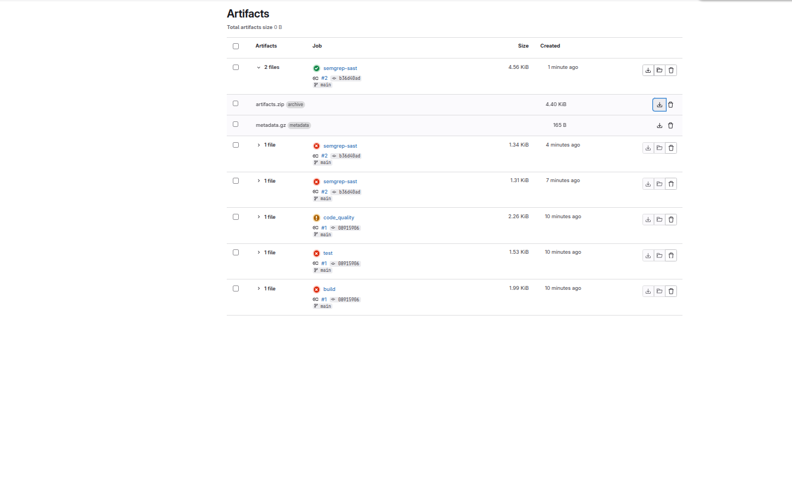
- Formated artifact file:
  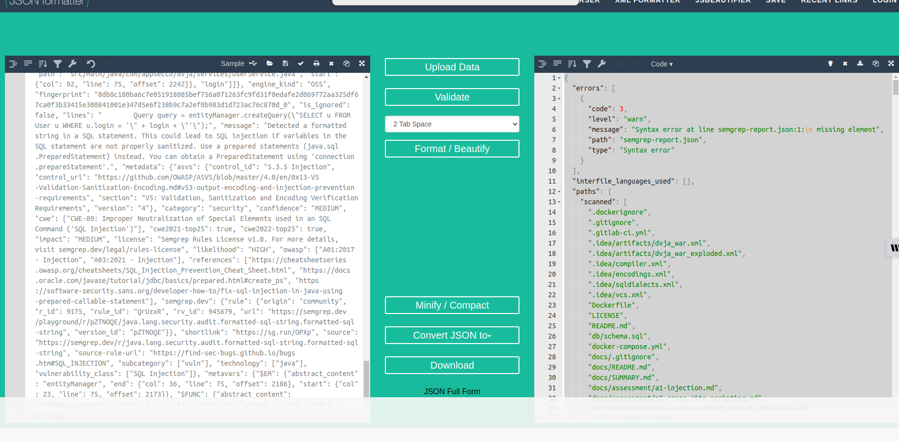

---

### Step 4: Analyzing the SAST Report

- Identified a SQL Injection vulnerability in `ProductService.java`.

**Vulnerable Code**:

```java
Query query = entityManager.createQuery("SELECT p FROM Product p WHERE p.name LIKE '%" + name + "%'");
```

**Mitigation**:

- Use parameterized queries to prevent SQL Injection.

**Fixed Code**:

```java
String queryString = "SELECT p FROM Product p WHERE p.name LIKE :name";
Query query = entityManager.createQuery(queryString)
                           .setParameter("name", "%" + name + "%");
```
