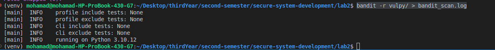
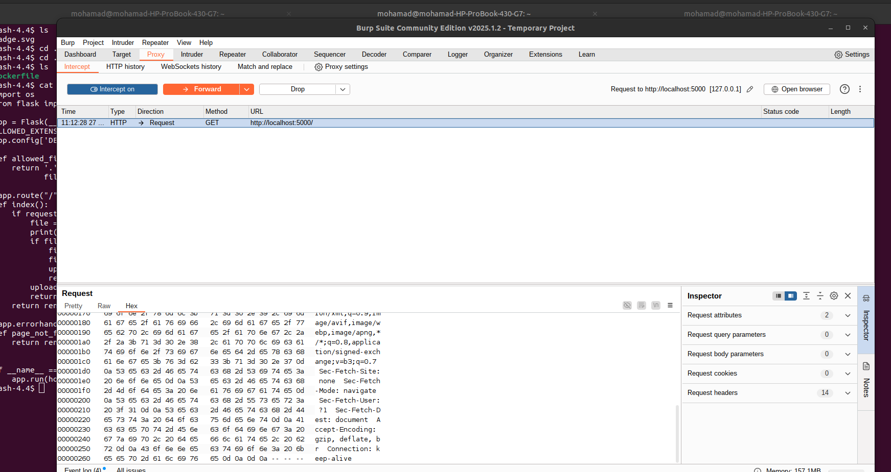

# Lab 2 - Vulnerability Scanning

## Secure System Development - Spring 2025

In this lab, you'll:

- Test out popular Static Application Security Testing (SAST) tools with different programming languages.
- Learn how to exploit basic web app vulnerabilities.
- Create a report with screenshots and explanations of your findings.

---

## Task 1 - SAST Tools

### 1.1 Bandit (Python)

```sh
python3 -m venv venv
source venv/bin/activate
pip install bandit
git clone git@github.com:fportantier/vulpy.git
bandit -r vulpy/ > bandit_scan.log
```



**Low Severity Issue:**

```log
--------------------------------------------------
>> Issue: [B404:blacklist] Consider possible security implications associated with the subprocess module.
   Severity: Low   Confidence: High
   CWE: CWE-78 (https://cwe.mitre.org/data/definitions/78.html)
   More Info: https://bandit.readthedocs.io/en/1.8.3/blacklists/blacklist_imports.html#b404-import-subprocess
   Location: vulpy/bad/brute.py:3:0
2 
3 import subprocess
4 import sys
```

**Explanation:**  
The `subprocess` module in Python is used to execute system commands. If we don't handle inputs properly, attackers could inject malicious commands. This can result in a security hole where someone could execute arbitrary commands on the system.  
**CWE-78** deals with improper handling of input, which can lead to command injection.  
**Solution:** Be careful when using `subprocess`. Always sanitize input properly or use safer alternatives.

---

**Medium Severity Issue:**

```log
--------------------------------------------------
>> Issue: [B113:request_without_timeout] Call to requests without timeout
   Severity: Medium   Confidence: Low
   CWE: CWE-400 (https://cwe.mitre.org/data/definitions/400.html)
   More Info: https://bandit.readthedocs.io/en/1.8.3/plugins/b113_request_without_timeout.html
   Location: vulpy/bad/api_post.py:30:8
29     api_key = api_key_file.open().read()
30     r = requests.post('http://127.0.1.1:5000/api/post', json={'text':message}, headers={'X-APIKEY': api_key})
31     print(r.text)
```

**Explanation:**  
When you make HTTP requests without setting a timeout, your program might freeze if the server doesn’t respond quickly enough. This could lead to performance issues or cause the system to become unresponsive.  
**CWE-400** covers how missing timeouts in requests can lead to denial of service attacks.  
**Solution:** Always add a timeout when making HTTP requests. This ensures the program doesn’t hang indefinitely if something goes wrong with the request.

---

**High Severity Issue:**

```log
--------------------------------------------------
>> Issue: [B201:flask_debug_true] A Flask app appears to be run with debug=True, which exposes the Werkzeug debugger and allows the execution of arbitrary code.
   Severity: High   Confidence: Medium
   CWE: CWE-94 (https://cwe.mitre.org/data/definitions/94.html)
   More Info: https://bandit.readthedocs.io/en/1.8.3/plugins/b201_flask_debug_true.html
   Location: vulpy/bad/vulpy-ssl.py:29:0
28 
29 app.run(debug=True, host='127.0.1.1', ssl_context=('/tmp/acme.cert', '/tmp/acme.key'))
```

**Explanation:**  
Running a Flask app with `debug=True` exposes detailed error messages and the Werkzeug debugger, which could allow attackers to execute arbitrary code on your system. This is a significant risk in production environments.  
**CWE-94** is about code injection, where attackers can execute their code remotely due to poor security configurations.  
**Solution:** Always disable debugging (`debug=False`) in production to avoid exposing sensitive information and prevent remote code execution.

---

### 1.2 Flawfinder (C)

```sh
pip install flawfinder
git clone git@github.com:hardik05/Damn_Vulnerable_C_Program.git
flawfinder Damn_Vulnerable_C_Program/ > flawfinder_scan.log
```

**Level 1 (Low Severity):**

```log
Damn_Vulnerable_C_Program/linux/imgRead_socket.c:74:  [1] (buffer) read:
  Check buffer boundaries if used in a loop including recursive loops
  (CWE-120, CWE-20).
```

**Explanation:**  
The `read` function is being used to read data into a buffer, but it's not checking if the buffer is large enough. This can cause a **buffer overflow** if more data is read than the buffer can handle, leading to potential security risks.  
**CWE-120** refers to buffer overflows, and **CWE-20** addresses improper input validation.  
**Solution:** Make sure to check the size of the buffer before using the `read` function. It's a good practice to use safer functions that limit the amount of data being read.

---

**Level 2 (Medium Severity):**

```log
Damn_Vulnerable_C_Program/dvcp.c:58:  [2] (buffer) memcpy:
  Does not check for buffer overflows when copying to destination (CWE-120).
  Make sure destination can always hold the source data.
```

**Explanation:**  
The `memcpy` function is used to copy data, but if it's not properly checked, it can overwrite memory areas, causing a **buffer overflow**. This can lead to crashes or, in the worst case, allow attackers to execute malicious code.  
**CWE-120** again refers to buffer overflows, and **CWE-120** refers to improper input validation.  
**Solution:** Always ensure that both source and destination buffers are large enough before using `memcpy`. Using safer alternatives can also help avoid these issues.

---

**False positive:**

```log
Damn_Vulnerable_C_Program/dvcp.c:33:  [2] (misc) fopen:
  Check when opening files - can an attacker redirect it (via symlinks),
  force the opening of special file type (e.g., device files), move things
  around to create a race condition, control its ancestors, or change its
  contents? (CWE-362).
```

**Explanation:**  
One false-positive finding from the logs could be the warning related to the use of `fopen`. The warning suggests checking for potential security risks, like attackers redirecting files or causing race conditions. However, this might not be an issue if the program carefully controls where files are opened, such as ensuring the file path is always secure and validated. If there’s no user input involved in choosing the file, and proper checks are in place, then this warning doesn’t apply and can be considered a false positive.

### 1.3 njsscan (NodeJS)

```sh
pip install njsscan
git clone git@github.com:appsecco/dvna.git
njsscan dvna/
```

**INFO Severity:**

```log
╒═════════════╤═════════════════════════════════════════════════════════════════════════════════════════════════════════════════════════════════════╕
│ RULE ID     │ cookie_session_default                                                                                                              │
├─────────────┼─────────────────────────────────────────────────────────────────────────────────────────────────────────────────────────────────────┤
│ CWE         │ CWE-522: Insufficiently Protected Credentials                                                                                       │
├─────────────┼─────────────────────────────────────────────────────────────────────────────────────────────────────────────────────────────────────┤
│ OWASP-WEB   │ A2: Broken Authentication                                                                                                           │
├─────────────┼─────────────────────────────────────────────────────────────────────────────────────────────────────────────────────────────────────┤
│ DESCRIPTION │ Consider changing the default session cookie name. An attacker can use it to fingerprint the server and target attacks accordingly. │
├─────────────┼─────────────────────────────────────────────────────────────────────────────────────────────────────────────────────────────────────┤
│ SEVERITY    │ INFO                                                                                                                                │
├─────────────┼─────────────────────────────────────────────────────────────────────────────────────────────────────────────────────────────────────┤
│ FILES       │ ╒════════════════╤═════════════════════════════╕                                                                                    │
│             │ │ File           │ dvna/server.js              │                                                                                    │
│             │ ├────────────────┼─────────────────────────────┤                                                                                    │
│             │ │ Match Position │ 9 - 3                       │                                                                                    │
│             │ ├────────────────┼─────────────────────────────┤                                                                                    │
│             │ │ Line Number(s) │ 23: 28                      │                                                                                    │
│             │ ├────────────────┼─────────────────────────────┤                                                                                    │
│             │ │ Match String   │ app.use(session({           │                                                                                    │
│             │ │                │   secret: 'keyboard cat',   │                                                                                    │
│             │ │                │   resave: true,             │                                                                                    │
│             │ │                │   saveUninitialized: true,  │                                                                                    │
│             │ │                │   cookie: { secure: false } │                                                                                    │
│             │ │                │ }))                         │                                                                                    │
│             │ ╘════════════════╧═════════════════════════════╛                                                                                    │
╘═════════════╧═════════════════════════════════════════════════════════════════════════════════════════════════════════════════════════════════════╛
```

**Explanation:**  
The default session cookie name could reveal information about the server, making it easier for an attacker to recognize and target specific vulnerabilities.  
**CWE-522** relates to insufficient protection of credentials, meaning that sensitive information, like session cookies, is not sufficiently protected from attackers.  
**Solution:** Change the default session cookie name to make it harder for attackers to detect and exploit the server based on the cookie name.

---

**WARNING Severity:**

```log
╒═════════════╤═════════════════════════════════════════════════════════════════════════════════════════════════════════════════╕
│ RULE ID     │ cookie_session_no_secure                                                                                        │
├─────────────┼─────────────────────────────────────────────────────────────────────────────────────────────────────────────────┤
│ CWE         │ cwe-614                                                                                                         │
├─────────────┼─────────────────────────────────────────────────────────────────────────────────────────────────────────────────┤
│ OWASP-WEB   │ A2: Broken Authentication                                                                                       │
├─────────────┼─────────────────────────────────────────────────────────────────────────────────────────────────────────────────┤
│ DESCRIPTION │ Default session middleware settings: `secure` not set. It ensures the browser only sends the cookie over HTTPS. │
├─────────────┼─────────────────────────────────────────────────────────────────────────────────────────────────────────────────┤
│ SEVERITY    │ WARNING                                                                                                         │
├─────────────┼─────────────────────────────────────────────────────────────────────────────────────────────────────────────────┤
│ FILES       │ ╒════════════════╤═════════════════════════════╕                                                                │
│             │ │ File           │ dvna/server.js              │                                                                │
│             │ ├────────────────┼─────────────────────────────┤                                                                │
│             │ │ Match Position │ 9 - 3                       │                                                                │
│             │ ├────────────────┼─────────────────────────────┤                                                                │
│             │ │ Line Number(s) │ 23: 28                      │                                                                │
│             │ ├────────────────┼─────────────────────────────┤                                                                │
│             │ │ Match String   │ app.use(session({           │                                                                │
│             │ │                │   secret: 'keyboard cat',   │                                                                │
│             │ │                │   resave: true,             │                                                                │
│             │ │                │   saveUninitialized: true,  │                                                                │
│             │ │                │   cookie: { secure: false } │                                                                │
│             │ │                │ }))                         │                                                                │
│             │ ╘════════════════╧═════════════════════════════╛                                                                │
╘═════════════╧═════════════════════════════════════════════════════════════════════════════════════════════════════════════════╛
```

**Explanation:**  
The `secure` flag on cookies ensures they are only sent over secure HTTPS connections. Without this flag, the cookie could be exposed during transmission over an insecure connection, making it vulnerable to interception by attackers.  
**CWE-614** refers to session fixation, where improper session management can allow attackers to hijack or manipulate sessions.  
**Solution:** Always set the `secure` flag for session cookies so they are transmitted only over HTTPS. This minimizes the risk of data being intercepted.

---

**ERROR Severity:**

```log
╒═════════════╤═══════════════════════════════════════════════════════════════════════════════════════════════════════════════════════════════════╕
│ RULE ID     │ node_xxe                                                                                                                          │
├─────────────┼───────────────────────────────────────────────────────────────────────────────────────────────────────────────────────────────────┤
│ CWE         │ CWE-611: Improper Restriction of XML External Entity Reference                                                                    │
├─────────────┼───────────────────────────────────────────────────────────────────────────────────────────────────────────────────────────────────┤
│ OWASP-WEB   │ A4: XML External Entities (XXE)                                                                                                   │
├─────────────┼───────────────────────────────────────────────────────────────────────────────────────────────────────────────────────────────────┤
│ DESCRIPTION │ User controlled data in XML parsers can result in XML External or Internal Entity (XXE) Processing vulnerabilities                │
├─────────────┼───────────────────────────────────────────────────────────────────────────────────────────────────────────────────────────────────┤
│ SEVERITY    │ ERROR                                                                                                                             │
├─────────────┼───────────────────────────────────────────────────────────────────────────────────────────────────────────────────────────────────┤
│ FILES       │ ╒════════════════╤══════════════════════════════════════════════════════════════════════════════════════════════════════════════╕ │
│             │ │ File           │ dvna/core/appHandler.js                                                                                      │ │
│             │ ├────────────────┼──────────────────────────────────────────────────────────────────────────────────────────────────────────────┤ │
│             │ │ Match Position │ 18 - 111                                                                                                     │ │
│             │ ├────────────────┼──────────────────────────────────────────────────────────────────────────────────────────────────────────────┤ │
│             │ │ Line Number(s) │ 235                                                                                                          │ │
│             │ ├────────────────┼──────────────────────────────────────────────────────────────────────────────────────────────────────────────┤ │
│             │ │ Match String   │ var products = libxmljs.parseXmlString(req.files.products.data.toString('utf8'), {noent:true,noblanks:true}) │ │
│             │ ╘════════════════╧══════════════════════════════════════════════════════════════════════════════════════════════════════════════╛ │
╘═════════════╧═══════════════════════════════════════════════════════════════════════════════════════════════════════════════════════════════════╛
```

**Explanation:**  
The vulnerability here is due to improper handling of XML data. An attacker can exploit a system by sending specially crafted XML that includes external entity references. These references can cause the system to process unintended data, leading to security issues like data leakage or remote code execution.  
**CWE-611** addresses vulnerabilities related to XML External Entity (XXE) attacks, where an attacker manipulates XML parsers to gain access to sensitive information.  
**Solution:** Disable external entity processing in XML parsers to prevent XXE attacks. This helps secure the system from potentially dangerous XML inputs.

## Task 2 - Web Security Mini Labs

### 1. Install BurpSuite (Community Edition)


---

### 2. Running Vulnerable Applications

#### 2.1 Cross-Site Scripting (XSS)

##### Running the XSS image

```bash
docker run -p 127.0.0.1:5000:5000 sh3b0/vuln:xss
```


##### Injecting a script


##### Results of injection


##### Captured in Burp Suite


**Why XSS is Dangerous:**
XSS allows attackers to inject malicious scripts into web pages viewed by other users. This can lead to session hijacking, data theft, and even malware distribution. To mitigate this, websites should sanitize and validate user inputs, implement Content Security Policy (CSP), and use secure frameworks that prevent script injection.

---

#### 2.2 Path Traversal

##### Running the path traversal image

```bash
docker run -p 127.0.0.1:5000:5000 sh3b0/vuln:path-traversal
```


##### Exploiting path traversal by modifying a request

Changing the value to `../../../etc/passwd`


##### After submitting


##### Captured in Burp Suite-1


**Why Path Traversal is Dangerous:**
Path traversal attacks allow attackers to access restricted directories and files, potentially exposing sensitive data such as configuration files or credentials. To prevent this, developers should normalize input paths, use allowlists for file access, and restrict user input.

---

#### 2.3 SQL Injection

##### Running the SQL Injection image

```bash
docker run -p 127.0.0.1:5000:5000 sh3b0/vuln:sql-injection
```


##### Attempting SQL Injection

Injecting `1 UNION SELECT * FROM users` into an input field.


**Why SQL Injection is Dangerous:**
SQL Injection can allow attackers to manipulate database queries, potentially exposing or modifying sensitive data. To prevent this, use prepared statements, ORM frameworks, and enforce strict input validation.

---

#### 2.4 File Upload Exploit

##### Running the file upload image

```bash
docker run -p 127.0.0.1:5000:5000 sh3b0/vuln:file-upload
```


##### Bypassing file upload restrictions

Uploading an HTML file and intercepting the request in Burp Suite to modify the file path.


##### Turning on intercept in Burp Suite



##### Uploading and submitting the HTML file


##### Successful exploitation


**Why Unrestricted File Upload is Dangerous:**
Attackers can upload malicious files (e.g., scripts, executables) to execute arbitrary commands. To prevent this, validate file types, use server-side checks, and store uploads outside the web root with randomized names.

---

#### 2.5 Command Injection

##### Running the command injection image

```bash
docker run -p 127.0.0.1:5000:5000 sh3b0/vuln:file-upload
```


##### Injecting a command into an HTML element

Modifying a field to include:

```bash
50%; rm -rf /static/img/bones.png
```


##### After injection


##### Captured output in terminal


**Why Command Injection is Dangerous:**
Command injection allows attackers to execute arbitrary commands on the server, potentially leading to data theft, system compromise, or destruction. To prevent this, avoid executing system commands with user input, use parameterized APIs, and apply strict input validation.
