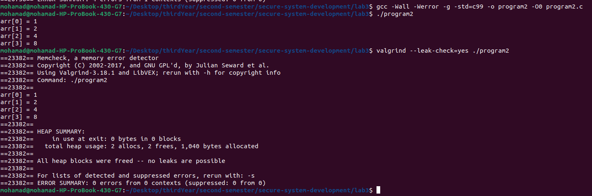

# Lab 3 - Memory Safety

## Task 1 - Getting Started

### 1. Install GCC and Valgrind

- **GCC** was already installed on my device. I verified this using the command:

  ```bash
  gcc --version
  ```

- **Valgrind** was installed using the package manager:

  ```bash
  sudo apt install valgrind
  valgrind --version
  ```


### 2. Create `program1.c`

The content of `program1.c` is as follows:

```c
#include<stdio.h>
#include<stdlib.h>

void program1(int N) {
    int *arr = malloc(N);
    for(int i = 0; i < N; i++) {
        arr[i] = i * i;
        printf("arr[%d] = %d\n", i, arr[i]);
    }
}

int main() {
    program1(4); // Should print the array [0, 1, 4, 9]
}
```

### 3. Compile `program1.c`

The compilation command used is:

```bash
gcc -Wall -Werror -g -std=c99 -o program1 -O0 program1.c
```

**Explanation of Flags:**

- `-Wall`: Enables all warnings.
- `-Werror`: Treats all warnings as errors.
- `-g`: Adds debugging information.
- `-std=c99`: Uses the C99 standard.
- `-o program1`: Specifies the output file name.
- `-O0`: Disables optimizations.


### 4. Run the Program

The program was executed using:

```bash
./program1
```


### 5. Run the Program with Valgrind

The program was executed with Valgrind using:

```bash
valgrind --leak-check=yes ./program1
```


### 6. Analyze Valgrind Output

The Valgrind output indicates two main memory-related issues:

1. **Invalid Memory Access (Out-of-Bounds Write & Read)**  
   - The program attempts to write and read past the allocated memory (`0x4a9b044 is 0 bytes after a block of size 4 alloc'd`).
   - The allocated size (4 bytes) suggests an `int` array of size **1** (`malloc(4)`), but the program accesses multiple elements (`arr[1]`, `arr[2]`, `arr[3]`).

   **CWE-787: Out-of-Bounds Write** – [MITRE Reference](https://cwe.mitre.org/data/definitions/787.html)  
   **CWE-125: Out-of-Bounds Read** – [MITRE Reference](https://cwe.mitre.org/data/definitions/125.html)

2. **Memory Leak**  
   - The program allocates memory but does not free it (`definitely lost: 4 bytes`).
   - Every `malloc` should have a corresponding `free`.

   **CWE-401: Memory Leak** – [MITRE Reference](https://cwe.mitre.org/data/definitions/401.html)

### 7. Propose Fixes

- **Fix the Memory Leak:** Add a `free` call after the `malloc` call.
- **Fix the Out-of-Bounds Access:** Ensure the array index is within the allocated size.

### 8. Verify Fixes

After applying the fixes, the program was recompiled and run with Valgrind:

```bash
gcc -Wall -Werror -g -std=c99 -o program1 -O0 program1.c
valgrind --leak-check=yes ./program1
```


[Updated program1.c](https://github.com/Mohammed-Nour/secure-system-development/blob/main/lab3/programs/program1.c)

---

## Task 2 - More Programs

### Program 2

#### 1. Create `program2.c`

The content of `program2.c` is as follows:

```c
#include<stdio.h>
#include<stdlib.h>
#include<string.h>

void work(int* arr, unsigned N) {
    for(int i=1; i<N; i++) {
        arr[i] = arr[i-1] * 2;
    }
    free(arr);
}

void program2(unsigned N) {
    int* arr = (int*)malloc(N * sizeof(*arr));
    memset(arr, 0, sizeof(*arr));
    arr[0] = 1;
    work(arr, N);
    for(int i=0; i<N; i++) {
        printf("arr[%d] = %d\n", i, arr[i]);
    }
}

int main() {
    program2(4); // Should print the array [1, 2, 4, 8]
}
```

#### 2. Compile with the following command `program2.c`

```bash
gcc -Wall -Werror -g -std=c99 -o program2 -O0 program2.c
```

The program was compiled and run with Valgrind:


#### 3. Run the program with the following command `program2.c`

```bash
./program2
```

- we running it, it doesn't give the correct ouptut


#### 4.  Run the program again with valgrind `program2.c`

```bash
valgrind --leak-check=yes ./program2
```


#### 5. Analyze Valgrind Output `program2.c`

1. **Use-After-Free**  
   - The program accesses memory (`arr[0]`, etc.) after it has been freed (`Address 0x4a9b040 is 0 bytes inside a block of size 16 free'd`).  

   **CWE-416: Use After Free** – [MITRE Reference](https://cwe.mitre.org/data/definitions/416.html)

#### 6. Propose Fixes `program2.c`

- **Fix:** Move the `free` call after the loop that prints the array.

#### 7. Verify Fixes `program2.c`

After applying the fixes, the program was recompiled and run with Valgrind:

```bash
gcc -Wall -Werror -g -std=c99 -o program2 -O0 program2.c
./program2
valgrind --leak-check=yes ./program2
```



[Updated program2.c](https://github.com/Mohammed-Nour/secure-system-development/blob/main/lab3/programs/program2.c)

---

### Program 3

#### 1. Create `program3.c`

The content of `program3.c` is as follows:

```c
#include<stdio.h>
#include<stdlib.h>
#include<string.h>

void* program3(unsigned N) {
    void *arr = malloc(N * sizeof(*arr));
    if((N < 1) || (arr = NULL)) {
        printf("%s\n", "Memory allocation falied!");
        return NULL;
    }
    printf("%s\n", "Memory allocation success!");
    return arr;
}

int main() {
    int* arr = (int*)program3(4); // Should typically succeed
    free(arr);
}
```

#### 2. Compile with the following command `program3.c`

```bash
gcc -Wall -Werror -g -std=c99 -o program3 -O0 program3.c
```

The program was compiled and run with Valgrind:


#### 3. Run the program with the following command `program3.c`

```bash
./program3
```

- we running it


#### 4.  Run the program again with valgrind `program3.c`

```bash
valgrind --leak-check=yes ./program3
```


#### 5. Analyze Valgrind Output `program3.c`

1. **Memory Leak**  
   - The program allocates memory but does not free it (`definitely lost: 4 bytes`).  

   **CWE-401: Memory Leak** – [MITRE Reference](https://cwe.mitre.org/data/definitions/401.html)

#### 6. Propose Fixes `program3.c`

- **Fix:** Correct the condition in the `if` statement to check for `arr == NULL` instead of `arr = NULL`.

#### 7. Verify Fixes `program3.c`

After applying the fixes, the program was recompiled and run with Valgrind:

```bash
gcc -Wall -Werror -g -std=c99 -o program3 -O0 program3.c
./program3
valgrind --leak-check=yes ./program3
```


[Updated program3.c](https://github.com/Mohammed-Nour/secure-system-development/blob/main/lab3/programs/program3.c)

---

### Program 4

#### 1. Create `program4.c`

The content of `program4.c` is as follows:

```c
#include<stdio.h>
#include<stdlib.h>
#include<string.h>

char* getString() {
    char message[100] = "Hello World!";
    char* ret = message;
    return ret;
}

void program4() {
    printf("String: %s\n", getString());
}

int main() {
    program4();
}
```

#### 2. Compile with the following command `program4.c`

```bash
gcc -Wall -Werror -g -std=c99 -o program4 -O0 program4.c
```

The program was compiled and run with Valgrind:


#### 3. Run the program with the following command `program4.c`

```bash
./program4
```

- we running it


#### 4.  Run the program again with valgrind `program4.c`

```bash
valgrind --leak-check=yes ./program4
```


#### 5. Analyze Valgrind Output `program4.c`

1. **Use of Uninitialized Variable**  
   - The program uses an uninitialized value in a conditional jump.  

   **CWE-457: Use of Uninitialized Variable** – [MITRE Reference](https://cwe.mitre.org/data/definitions/457.html)  

2. **Uninitialized Memory Access**  
   - The program reads uninitialized memory before writing output.  

   **CWE-119: Improper Restriction of Operations within the Bounds of a Memory Buffer** – [MITRE Reference](https://cwe.mitre.org/data/definitions/119.html)

#### 6. Propose Fixes `program4.c`

- **Fix:** Remove the `message` array and initialize `ret` with the string value directly.

#### 7. Verify Fixes `program4.c`

After applying the fixes, the program was recompiled and run with Valgrind:

```bash
gcc -Wall -Werror -g -std=c99 -o program4 -O0 program4.c
./program4
valgrind --leak-check=yes ./program4
```


[Updated program4.c](https://github.com/Mohammed-Nour/secure-system-development/blob/main/lab3/programs/program4.c)

---

## Task 3 - Vulnerable HashMap Library

### 1. Identify and Fix CWEs

#### CWE-835: Loop with Unreachable Exit Condition (Infinite Loop)

- **Issue:** The `HashIndex` function had an infinite loop due to an incorrect termination condition.
- **Fix:** Corrected the loop to terminate at the end of the string.

  ```c
  for (const char* c = key; *c != '\0'; c++) {
      sum += *c;
  }
  ```

#### CWE-457: Use of Uninitialized Variable

- **Issue:** `sum` in `HashIndex` was not initialized.
- **Fix:** Initialized `sum` to 0.

  ```c
  int sum = 0;
  ```

#### CWE-125: Out-of-bounds Read

- **Issue:** The hash index could exceed the array bounds.
- **Fix:** Applied modulo `MAP_MAX` to ensure valid indices.

  ```c
  return sum % MAP_MAX;
  ```

#### CWE-480: Use of Incorrect Operator

- **Issue:** `strcmp` check in `HashFind` and `HashDelete` was inverted.
- **Fix:** Corrected the condition to check for equality.

  ```c
  if (strcmp(val->KeyName, key) == 0)
  ```

### 2. Implement Improvements

- Refer to [Secure Coding Guidelines](https://securecoding.cert.org/) for best practices.
- Updated code can be found in the repository: [Updated hash.c](https://github.com/Mohammed-Nour/secure-system-development/blob/main/lab3/programs/hash.c)

### 3. Verify Fixes

The code was compiled and run with Valgrind to ensure no memory-related issues were present.


