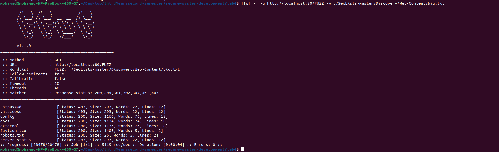
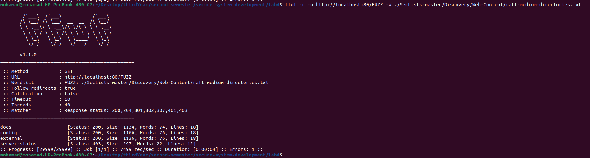
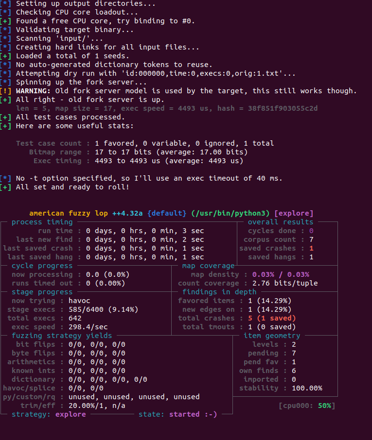

# Lab 4 - Fuzzing  

## Task 1 - WebApp Fuzzing

### Install `ffuf` and SecLists

#### ffuf installation

```bash
sudo apt install ffuf
```


#### SecLists

Download SecLists from GitHub, unzip it, and remvove the zipped file:

```bash
wget -c https://github.com/danielmiessler/SecLists/archive/master.zip -O SecList.zip && unzip SecList.zip && rm -f SecList.zip
```


---

### Run DVWA with Docker

```bash
docker run -d -p 127.0.0.1:80:80 vulnerables/web-dvwa
```

- `-d`: Run container in detached mode  
- `-p`: Map host port 80 to container port 80  


---

### Fuzz Endpoints using `big.txt`

```bash
ffuf -r -u http://localhost:80/FUZZ -w ./SecLists-master/Discovery/Web-Content/big.txt
```

- `-u`: Target URL where `FUZZ` is replaced by each word  
- `-w`: Wordlist path  
- `-r`: check the flow of 3xx redirections.  



#### Observations

```log
.htpasswd               [Status: 403, Size: 293, Words: 22, Lines: 12]
.htaccess               [Status: 403, Size: 293, Words: 22, Lines: 12]
config                  [Status: 200, Size: 1166, Words: 76, Lines: 18]
docs                    [Status: 200, Size: 1134, Words: 74, Lines: 18]
external                [Status: 200, Size: 1136, Words: 76, Lines: 18]
favicon.ico             [Status: 200, Size: 1405, Words: 5, Lines: 2]
robots.txt              [Status: 200, Size: 26, Words: 3, Lines: 2]
server-status           [Status: 403, Size: 297, Words: 22, Lines: 12]
```

- `200`: Accessible → `robots.txt`, `favicon.ico`, `config`, `docs`, `external`
- `403`: Forbidden (interesting) → `.htaccess`, `.htpasswd`, `server-status`

---

### What file extensions are available for `index`?

```bash
ffuf -r -u http://localhost:80/indexFUZZ -w ./SecLists-master/Discovery/Web-Content/web-extensions.txt
```


#### Result

- `index.php` found, and returns `200`
- `index.phps` found, but returns `403` (forbidden)

---

### Directory Fuzzing using `raft-medium-directories.txt`

```bash
ffuf -r -u http://localhost:80/FUZZ -w ./SecLists-master/Discovery/Web-Content/raft-medium-directories.txt
```



#### Observations1

```log
docs                    [Status: 200, Size: 1134, Words: 74, Lines: 18]
config                  [Status: 200, Size: 1166, Words: 76, Lines: 18]
external                [Status: 200, Size: 1136, Words: 76, Lines: 18]
server-status           [Status: 403, Size: 297, Words: 22, Lines: 12]

```

- `200`: `config`, `docs`, `external`
- `403`: `server-status` → Forbidden access (interesting)

---

## Task 2 - Python Fuzzing

---

### Run AFL++ Docker & Install `python-afl`

```bash
docker run --name afl -ti -v ./main.py:/src/main.py aflplusplus/aflplusplus
pip install python-afl
```

- `--name afl`: Names the container "afl"
- `-ti`: Runs in interactive terminal mode
- `-v ./main.py:/src/main.py`: Mounts `main.py` into the container  
- `aflplusplus/aflplusplus`: Uses the AFL++ Docker image


---

### Prepare Input Directory (Seed Corpus)

- Created `/src/input/` with seed input file `input.txt` containing:

```log
test
```


---

### Run the Fuzzer

```bash
cd /src
py-afl-fuzz -i input -o output -- /usr/bin/python3 main.py
```


---

### Let It Run (Detect Crash & Hang)



running it for around 1 min


---

### Analyze Results

#### `fuzzer_stats`


#### Crash Input

```log
eeeeeee%ee%
```


#### Hang Input

```log
+ttpp
att%eeettt%eet$+V
```


---

### Reproduce Crash & Hang

| Case | Input           | Root Cause | Fix |
|------|------------------|------------|-----|
| Crash | `%`              | Invalid checking input length | Check `i + 2 < len(s)` before parsing `%` |
| Hang  | `+`              | Missing `i += 1` → infinite loop   | Add `i += 1` after `ret.append(' ')` |

---

### Theory & Reflection

#### Will the fuzzer ever terminate?

> **No.** AFL++ runs indefinitely, continuously mutating inputs unless explicitly stopped.

#### How do coverage-guided fuzzers work?

>
They monitor which code branches are triggered by each input and prioritize mutations that explore new paths.

**Yes**, AFL++ is coverage-guided—it uses edge coverage to guide input generation.
>

#### How to optimize a fuzzing campaign?

> Use high-quality seed inputs, run in parallel, reduce redundant/crashing inputs, and monitor coverage growth.

[Link to Github Lab](https://github.com/Mohammed-Nour/secure-system-development/tree/main/lab4)
