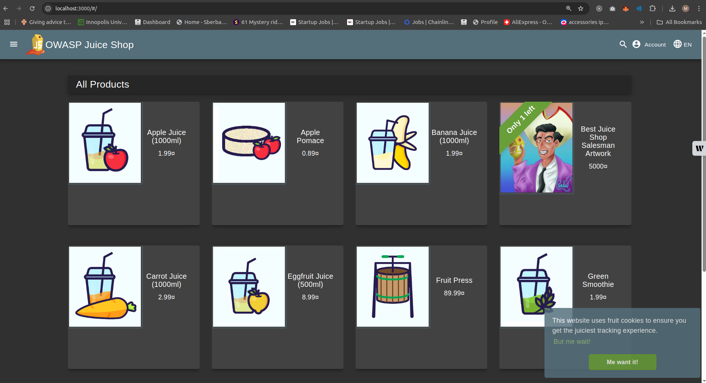
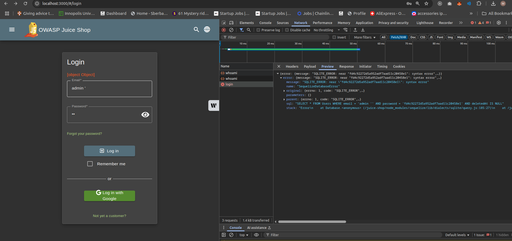

# Lab 5 - Web Application Firewall (WAF)

## Task 1 - Blocking SQLi with WAF

### 1. Deploy Juice Shop

I created a `docker-compose.yaml` file to deploy Juice Shop on port `3000`:

```yaml
app:
  container_name: jucie-shop
  image: bkimminich/juice-shop
  ports:
    - "3000:3000"
```

To launch it:

```bash
docker compose up -d
```

Then accessed the app at [http://localhost:3000](http://localhost:3000).




---

### 2. SQL Injection Exploit

I attempted an SQLi in the login form's **email field** using:



```input
asdf ' OR 1=1 --
```

- `asdf '` closes the string.
- `OR 1=1` always returns true.
- `--` comments out the rest.

 This allowed me to login as admin.

**Before SQLi:**

**After SQLi:**


---

### 3. Deploy WAF with ModSecurity + CRS

I updated my Docker Compose to add a WAF container running [`owasp/modsecurity-crs:nginx`], and placed both services on the same network:

```yaml
services:
  app:
    container_name: jucie-shop
    image: bkimminich/juice-shop
    networks:
      - appnet

  waf:
    container_name: web-application-firewall
    image: owasp/modsecurity-crs:nginx
    environment:
      - BACKEND=http://app:3000
    ports:
      - "8080:8080"
    networks:
      - appnet

networks:
  appnet:
    driver: bridge
```

 Now, Juice Shop is only accessible through the WAF at port `8080`:


 Direct access via port `3000` is disabled:


---

### 4. WAF Blocks Original Exploit

The SQLi payload that previously worked (`asdf ' OR 1=1 --`) is now **blocked** by default CRS rules:


---

## Task 2 - Bypassing WAF

### 1. Update Exploit to Bypass WAF

I used a WAF evasion technique from [YesWeHack](https://www.yeswehack.com/learn-bug-bounty/web-application-firewall-bypass):

```input
\' OR 1=1 --
```

 This payload bypassed the default CRS:

- It escapes the quote as `\'`
- Then uses a standard tautology (`OR 1=1`)
- Comments out the rest

📸 Bypass in action:


---

### 2. Add Custom Rule to Block Bypassed Exploit

I created a file `custom-rule-sqli.conf` with the following rule:

```conf
SecRule ARGS|ARGS_NAMES|REQUEST_URI|REQUEST_HEADERS|REQUEST_BODY "@rx (?i:(\\'|%5C%27)\s*(or|and|union|select|insert|group|having|benchmark|sleep)\b)" \
  "id:100102,phase:2,t:none,t:urlDecodeUni,log,deny,status:403,msg:'SQLi: escaped quote followed by SQL keyword',severity:CRITICAL"
```

### 🔍 Explanation

- **Targets**: All request fields (ARGS, headers, URI, body)
- **Regex**: Matches `\'` or `%5C%27` followed by common SQL keywords
- **t:urlDecodeUni**: Decodes URL encoding before matching
- **deny,status:403**: Blocks the request

Mounted the rule in `docker-compose.yml`:

```yaml
volumes:
  - ./custom-rule-sqli.conf:/etc/modsecurity.d/owasp-crs/rules/custom-rule-sqli.conf:ro
```

 Confirmed it's loaded:


---

### 3. Apply Config & Retest

After restarting the WAF, I tested again:

- Input: `\' OR 1=1 --`
- Result: Blocked


---

### 4. Automated SQLi Test with sqlmap

Ran this command:

```bash
python3 sqlmap.py -u "http://localhost:8080/rest/user/login" \
  --data='{"email":"\\\\' OR 1=1--", "password":"x"}' \
  --headers="Content-Type: application/json" \
  --level=5 --risk=3 \
  --technique=BEUSTQ \
  --random-agent --batch -v 3 \
  --ignore-code 401
```

 Before Custom Rule:

```log
403 (Forbidden) - 28845 times
```

 After Custom Rule:

```log
403 (Forbidden) - 41406 times
```


### Final Results Summary

> Before adding the custom rule, the WAF blocked about 29,000 SQL injection attempts using default CRS rules. After adding my custom rule, over 41,000 requests were blocked. This shows that the custom rule improved security by catching more SQL injection patterns that might bypass default protections.

[Github Link](https://github.com/Mohammed-Nour/secure-system-development/tree/main/lab5)

---
